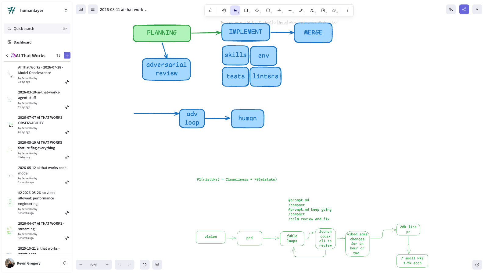

# 🦄 ai that works: Unconference RECAP

> On Saturday, August 8th, we hosted another unconference bringing together some of the brightest minds in AI. This week on the podcast we recap it: the best takeaways, what we learned, and what you missed if you weren't there.

[Video](https://www.youtube.com/watch?v=fyZ0i4USjgc)

Links:

## Episode Highlights

## Key Takeaways

- **Nobody at the unconference disagreed on one thing: unattended models write slop code.** Every attendee is running a different process, and everyone changes that process every few months. The consensus wasn't a fix, it was "we're all still figuring stuff out."
- **Some teams built seventy deterministic linters instead of updating a prompt.** Every time a Rust team catches an anti-pattern, they write a linter for it instead of adding a note to the agent's memory, so the next time the pattern shows up the agent gets a hard signal instead of a vibe. For cheaper models like DeepSeek V4 Flash, a plain list of a hundred "this should never happen" rules gets almost as far, just slower and pricier per check.
- **Evals for skills, not just for output, was the idea that stuck with Vaibhav.** Split a software factory into planning and implementing. Given a plan, a skill set, an environment, and tests, the implement loop is fairly evaluable: if the output is bad, it's the skill, the plan, or the environment, and you can isolate which. You can take a plan you already know worked, swap out one skill, and rerun it to check if the implementation still holds up.
- **Almost everyone had independently converged on some form of adversarial review before a human ever sees the diff.** Different names, same shape: run a loop that pokes holes in the output before it reaches a person, stacking the odds in the human's favor by the time they look. The word "adversarial" doesn't do the work by itself, it just catches the dumb stuff faster.
- **Changing a model's reasoning effort mid-conversation invalidates your entire prompt cache, not just the reasoning block.** Reasoning tokens sit near the front of the prompt, so flipping "low" to "high" partway through blows away everything cached after it, all the way back to the start.
- **Where do you put your plan docs? Not in Git.** The progression almost every team hits: check `plan.md` into the repo, split it by feature, lose track of which branch a plan lives on, then discover GitHub can't comment on a document unless it's a diff. HumanLayer's fix was to git-ignore the plans and sync them to an external system instead, so multiple agents editing the same doc stay in sync without Git in the loop.

## Resources

- [Session Recording](https://www.youtube.com/watch?v=fyZ0i4USjgc)
- [Discord Community](https://boundaryml.com/discord)
- Sign up for the next session on [Luma](https://lu.ma/baml)

## Whiteboards

