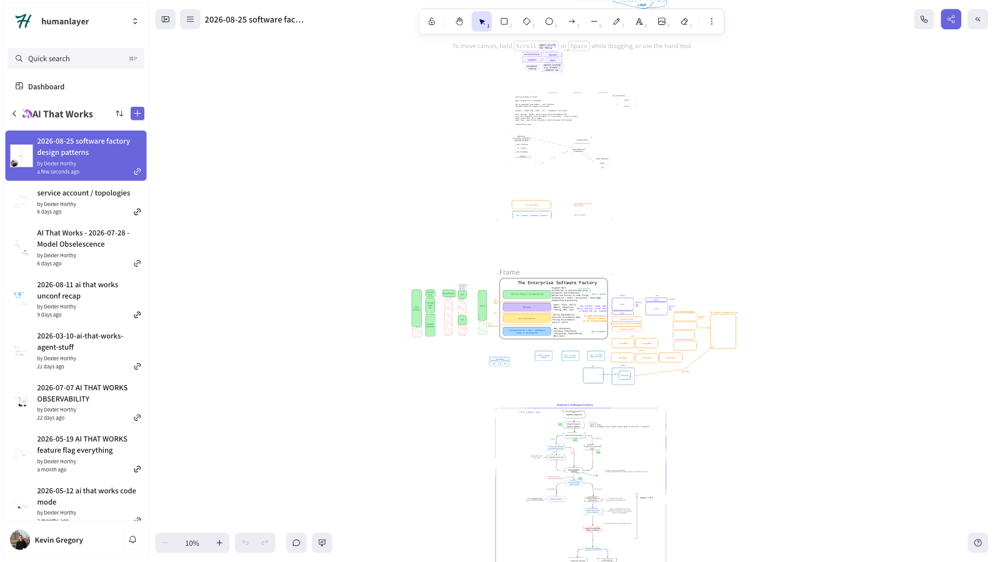

# 🦄 ai that works: Software Factory Design Patterns

> Dex and Vaibhav zoom in on the part of the software factory where agents actually build and test the thing, mapping out the four core layers (compute, dev environment, harness, orchestration) and where to buy versus build at each one.

[Video](https://www.youtube.com/watch?v=tGbjIvvYuHE)

Links:

- [Session Code](https://github.com/ai-that-works/ai-that-works/tree/main/2026-08-25-software-factory-design-patterns)

## Episode Highlights

> "A factory that cannot trace a part back to the station that made it cannot compute yield, and yield is the entire reason to build a factory."

> "The goal of the software factory is not to build software. The goal of the software factory is to deliver on whatever's on the other side of that. This is the industrialization of the process."

> "The folly a lot of people make is they try to build a system that is fully automatic. That's much harder than getting a system that's 95% automatic."

> "You should be able to instead of having to buy everything below whatever layer you buy at, or build the whole thing yourself, work in open systems and plug these things together. It's composition over inheritance."

> "If I can only write the workflows that you let me write, I'm kind of sad. But if I can write the workflows on your stack and buy the reliability from you, that's totally worth paying for."

## Key Takeaways

- **Every agentic software factory breaks down into four layers: compute, dev environment, harness, and orchestration.** Compute is just where the agent runs, Boundary uses a pool of MacBooks with pre-installed tool chains so there's zero boot-up time. Dev environment is what the agent needs to build and test, harness is `Claude Code`/`Codex`/custom, and orchestration is the control plane that dispatches work and decides what to do with feedback.
- **The dev environment layer causes the most friction, and Google and Facebook already solved it a decade ago.** Nobody at Google codes on their laptop, they spin up a "cloudtop" and get a shareable subdomain by default for every internal service. Most teams building agent factories today are quietly reinventing that same golden path.
- **Decide whether your dev environment is "pets" or "cattle" before you scale.** A pet is a server you keep alive and patch by hand, like a MacBook fleet where adding a machine means running a setup script manually. Cattle is disposable and provisioned on demand. Pets are a fine place to start if you're not running thousands of workflows a day, cattle is the end state once you are.
- **The harness layer has no standard interface yet, and that's not an accident.** Protocols like ACP and AG-UI let a harness talk to a UI, but neither supports hooks, the lifecycle events a control plane needs to react to mid-session. `Claude Code`, `Codex`, and Pi all implement hooks completely differently because each harness makes different tradeoffs.
- **Stop forcing a choice between "buy the whole stack" or "build the whole stack."** It should be composition over inheritance: if you want orchestration that can ping agents from Slack, you shouldn't have to build your own compute and harness from scratch, or hand a vendor your entire workflow. Boundary deliberately doesn't own the harness layer so it can stay swappable between `Claude Code` and `Codex`.

## Resources

- [Session Recording](https://www.youtube.com/watch?v=tGbjIvvYuHE)
- [Discord Community](https://boundaryml.com/discord)
- Sign up for the next session on [Luma](https://lu.ma/baml)

## Whiteboards

